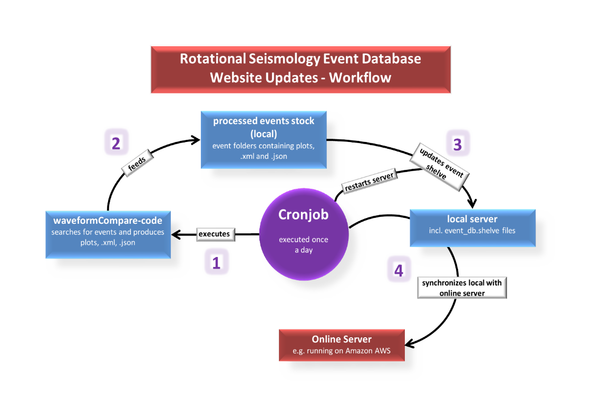

# WaveformCompare-DATABASE PROCESSING


## Workflow



## List of important files and folders:

* waveformCompare (main-folder)

  - Amazon.pem (Only as long as the database runs on an Amazon AWS server)

  - Catalog_composition_guide.txt (contains info of how to recalculate the whole database)

  - CRONTAB_waveformCompare.txt (backup for the crontab --> put in "crontab -e" if the old one is lost, but CHECK PATHS!)

  - explanations_tex (folder that contains the latex-files for creating the Processing-Guide linked on the webpage)

  - IPYTHON_Notebooks (contain the notebooks used on the seismo-live Website)
  -> find them in IPYTHON_Notebooks/seismo-live/notebooks/Rotational Seismology

  - sync_and_reload_server.sh (used to synchronize with the Amazon-server 
                             to keep the publicly available database up to date)

  - waveformCompare_20160802_master.py (or any more recent version, event processing -> database entries!)

  - XML-extra_events (contains quakeML-catalogs for ISC-picked events. Most of them are local and low magnitude)
	
  - database (folder)
    
	- application.wadl (guide to database http-requests)
	- config.py (configuration file for the server)
	- event_db.shelve."[bak, dat, dir]" (actual event shelve that contains all the database information)
	- event_shelve.py (functions that create the database-files and handle server-requests)
	- server.py (flask-server that keeps everything going, handles requests)

	- templates (folder)
		- base.html (base for the website, loads js-functions and css-styles)
		- index.html (contains all the client_side application handlers, webpage layout)

	- static (folder)
		- css (folder, contains all css-stylesheets needed)
		- explanations.pdf (Processing guide, downloadable on the webpage)
		- fetch_data.py (data fetching example code snippet, downloadable on webpage)
		- images (folder, images used for webpage)
		- ionrangeSlider (folder, webpage-Magnitude-slider, css and javascript files)
		- jquery_datepick (folder, webpage-datepicker, css and javascript files)
		- js (folder, other javascript functions used on the webpage)
		- OUTPUT (folder, contains all the processed event folders incl. each: 4 images, xml-file, json-file)
		- sweetalert_master (folder, webpage-alerts, css and javascript files)


## Troubleshooting/ Preparation:

### 1) Server complains about flask --> does not start at all: 
 1st step: set public-variable to "False" in config.py which turns on the debug mode! 
 Then, install the following Python(-flask) packages and keep restarting the server:
  - Python 2.7 or newer (3.4 works)
  - Flask
  - Flask-Cache
  - Flask-FlatPages
  - WTForms
  - python geojson
  - Obspy in a recent version
  
  e.g. on a UNIX system with pip:

```bash
  $ pip install flask flask-cache
  $ pip install Flask-FlatPages
  $ pip install WTForms
  $ pip install geojson
  $ pip install obspy
```

### 2) No more updates on server:
 - Does the cronjob still work properly? If it was deleted because of a system update or change of machine, you'll have to   
   reinstall it. For this just copy the CRONTAB_waveformCompare.txt into the "crontab -e"-shell prompt. CAUTION: You may have 
   to change the paths!
 - Did you change the waveformCompareXXXXXXXX_master.py? if so, you should have made an backup file. Use it to try and find 
   your bug! 


### 3) Webpage is not visible, shows artifacts or cannot be accessed at all:
   There could be multiple reasons:
 - Does the Browser still support all of the javascript/jquery functions or html-methods? -> solve by replacing them.
 - Did you mess with the index.html, base.html, server.py, or event_shelve.py? -> If so try to change them back or use a   
   backup (which I assume you have).
 - Map-distorted/ invisible: Is the mapbox-account still up to date? Could also be linked to leaflet problems.
   On the other hand it does not have to be linked to the map at all. If just a small error happens to appear in the   
   index.html, the map will be the first to crash even if it's not related to that problem.


### 4) Event contents seem mixed up/ events plotted on wrong locations on map/ contents missing:
 - Check the OUTPUT folder! Maybe something went wrong with the event calculation. In this case you should find
   event folders that contain less than 6 files (4 images, .xml, .json). This should not happen since the waveformCompare-code
   removes incomplete folders right away. But if the code is interrupted, this might happen.
   SOLUTION: Delete these event-folders and recalculate the events!


## Limitations:

DO NOT OPEN THE SERVER TO THE PUBLIC - zero effort has been put into security!

Only one event per QuakeML file is allowed. This is only to simplify the implementation. During indexing it will warn you if it cannot read a file due to this or other issues.

The following query parameters are silently ignored: latitude, longitude, minradius, maxradius (these four are used for radial search queries which could be implemented pretty easily if desired - minlatitude and consorts work fine), magnitudetype, catalog, contributor, updatedafter, and include*.

The database is only updated upon starting the server. So every time your data set changes you will need to restart the server (the indexes are persistent so restarting is fairly cheap). You can do this via cronjob if you want automatic updates (see "CRONTAB_waveformCompare.txt" for example).
Open crontab: 
```bash
$ crontab -e
```
Of course you will have to change the paths!


If you are completely desperate, contact me: salv_johannes@gmx.de


